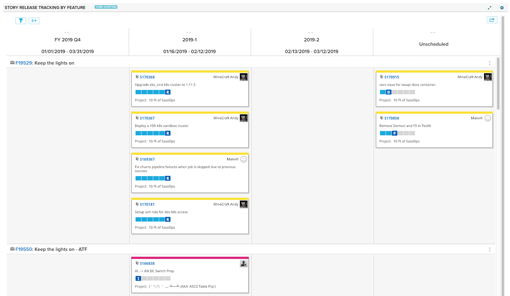

Release Tracking (Stories)
=========================

## Overview
This is a simple board view that shows stories spread across iterations and teams for the selected Release/PI. 
It has filtering capability, field picker to determine what fields show on the cards, and printing.

## Screenshots

## License

StoryReleaseTracking is released under the MIT license.  See the file [LICENSE](./LICENSE) for the full text.
